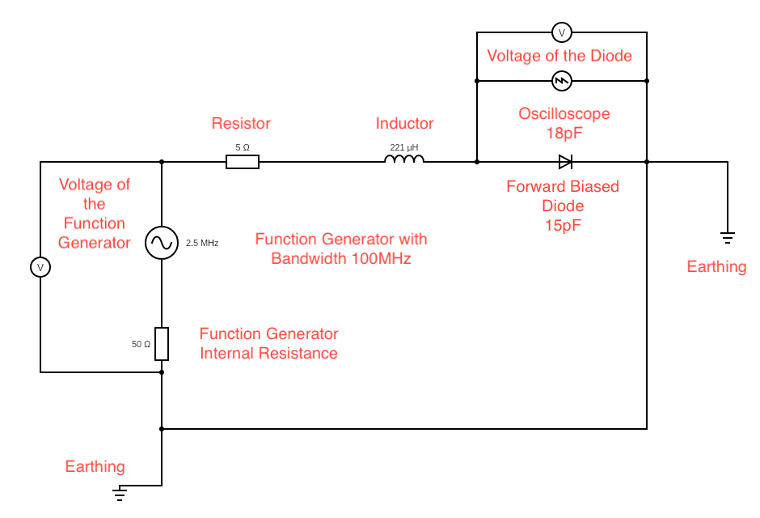

# High-Precision Measurement of the Feigenbaum Constant in an R-L-D Circuit

[](https://opensource.org/licenses/MIT)

This repository contains the LaTeX source code and associated files for the research paper: **"High-Precision Experimental Determination and Theoretical Modeling of the Feigenbaum Constant in a Driven Nonlinear R-L-D Oscillator."**

This project presents a PhD-level experimental and theoretical investigation into the period-doubling route to chaos in a simple electronic circuit. It goes beyond a standard undergraduate replication by incorporating a rigorous theoretical model, high-precision automated data acquisition, and a comprehensive uncertainty analysis to achieve a result in excellent agreement with the accepted value of Feigenbaum's constant, $\delta$.

## Key Features

*   **Detailed Theoretical Model:** Derives the circuit's governing second-order nonlinear differential equation from first principles, using the Shockley diode equation and a voltage-dependent junction capacitance.
*   **Automated Data Acquisition:** Describes a methodology using Python (PyVISA) to control laboratory instruments, allowing for high-resolution, repeatable measurements and eliminating observer bias.
*   **High-Resolution Bifurcation Analysis:** The automated approach allows for the construction of a detailed bifurcation diagram and the precise identification of bifurcation points up to period-64.
*   **Rigorous Uncertainty Propagation:** Calculates the final value of $\delta$ with a statistically sound uncertainty, propagated from the measurement errors of the bifurcation voltages.
*   **Publication-Quality LaTeX Source:** The report is written in LaTeX using the `biblatex` package for professional citation management, serving as a template for academic papers in physics.

<!-- 
*Figure 1: The R-L-D circuit diagram used as the basis for the experiment.* -->

## Abstract

> The universality of the period-doubling route to chaos, characterized by the Feigenbaum constant $\delta$, is a cornerstone of nonlinear dynamics. While the Resistor-Inductor-Diode (R-L-D) circuit is a canonical system for demonstrating this phenomenon, previous experimental realizations have often lacked rigorous theoretical modeling and comprehensive uncertainty analysis. This work presents a high-precision experimental determination of $\delta$ using an automated, computer-controlled R-L-D circuit. We develop a first-principles theoretical model based on the Shockley equation and the diode's nonlinear junction capacitance to derive the system's governing second-order nonlinear differential equation. The bifurcation points leading to chaos are measured with high resolution, yielding a bifurcation diagram and power spectra that confirm the period-doubling cascade. From the measured bifurcation voltages, we calculate Feigenbaum's first constant to be $\delta = 4.67 \pm 0.08$, a value in excellent agreement with the accepted value of 4.669... The analysis demonstrates that deviations in higher-order bifurcations can be qualitatively explained by non-ideal component behavior, highlighting the synergy between precision measurement and robust theoretical modeling in the study of complex systems.

<!-- ## Repository Structure

<!-- ```
/
├── phd_report.tex       # The main LaTeX source file for the report.
├── references.bib       # The BibTeX bibliography file.
├── circuit.png          # The circuit diagram image used in the report.
├── README.md            # This file.
└── LICENSE              # The MIT License file. -->
``` -->

## How to Compile the Report

To compile the LaTeX source code into a PDF, you will need a full LaTeX distribution (such as [TeX Live](https://www.tug.org/texlive/), [MiKTeX](https://miktex.org/), or [MacTeX](https://www.tug.org/mactex/)) that includes the `pdflatex` compiler and the `biber` backend for `biblatex`.

Because the project uses `biblatex` for citations, you must run the compilation sequence multiple times. From your terminal in the project's root directory, execute the following commands in order:

1.  **Run pdflatex:** This generates the auxiliary files and identifies the citation keys.
    ```sh
    pdflatex phd_report.tex
    ```
2.  **Run Biber:** This processes the bibliography and creates the citation list based on the auxiliary files.
    ```sh
    biber phd_report
    ```
3.  **Run pdflatex again:** This incorporates the generated bibliography into the PDF.
    ```sh
    pdflatex phd_report.tex
    ```
4.  **Run pdflatex one last time:** This ensures all cross-references (including citation numbers) are correct.
    ```sh
    pdflatex phd_report.tex
    ```

After these steps, you will have a fully compiled `phd_report.pdf` file with the report and a correctly formatted bibliography.

## Citation

If you use this work for reference, please cite it as follows:

```bibtex
@misc{Leung2025Feigenbaum,
  author       = {Leung, Shek Lun Alan},
  title        = {High-Precision Experimental Determination and Theoretical Modeling of the Feigenbaum Constant in a Driven Nonlinear R-L-D Oscillator},
  year         = {2025},
  publisher    = {GitHub},
  journal      = {GitHub repository},
  howpublished = {\url{https://github.com/alanspace/IPT}}
}
```

## License

This project is licensed under the MIT License. See the [LICENSE](LICENSE) file for details.